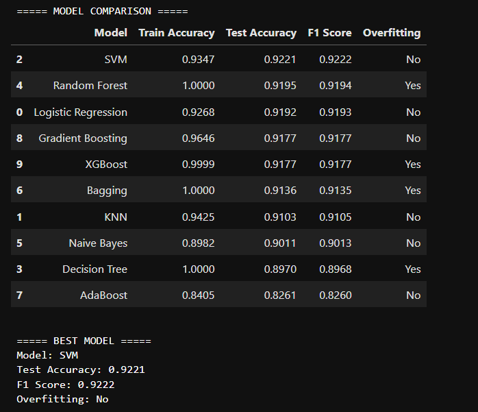
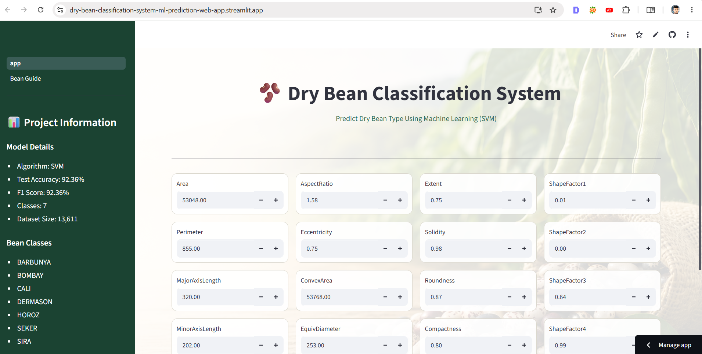
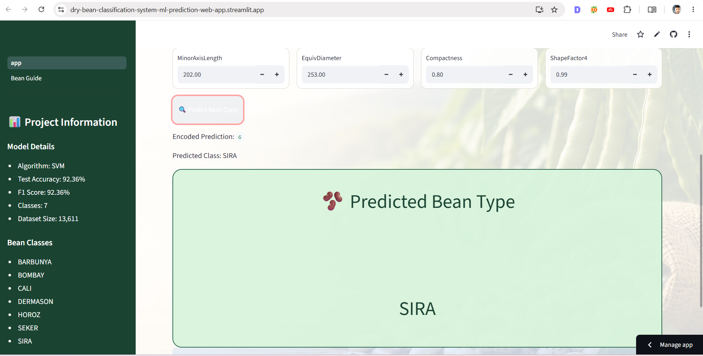

# 🫘 Dry Bean Classification System

A Machine Learning-powered web application that predicts the class of dry beans based on their physical measurements.

This project uses **Support Vector Machine (SVM)**, selected after comparing multiple classification algorithms and evaluating them using Accuracy, F1 Score, and Overfitting Analysis.

---

## 🌐 Live Demo

🚀 **Try the Application**

https://dry-bean-classification-system-ml-prediction-web-app.streamlit.app/

---

## 👨‍💻 Developer

**Sumit Ghodke**

🔗 LinkedIn Profile:

https://www.linkedin.com/in/sumit-ghodke-a45a82205/

---

## 📌 Project Overview

The objective of this project is to classify dry bean varieties using machine learning based on their geometric and shape-related characteristics.

The application allows users to:

* Enter bean measurements
* Predict bean variety instantly
* Explore measurement references
* Learn about different dry bean classes
* Use an interactive Streamlit web interface

---

## 📊 Dataset Information

Dataset: Dry Bean Dataset

Number of Classes: 7

Bean Varieties:

* BARBUNYA
* BOMBAY
* CALI
* DERMASON
* HOROZ
* SEKER
* SIRA

Features Used:

* Area
* Perimeter
* MajorAxisLength
* MinorAxisLength
* AspectRatio
* Eccentricity
* ConvexArea
* EquivDiameter
* Extent
* Solidity
* Roundness
* Compactness
* ShapeFactor1
* ShapeFactor2
* ShapeFactor3
* ShapeFactor4

---

## 🔬 Machine Learning Workflow

### Data Preprocessing

* Missing value checking
* Duplicate value checking
* Label Encoding
* Log Transformation
* Yeo-Johnson Power Transformation
* Feature Scaling using StandardScaler

### Model Building

The following classification algorithms were evaluated:

* Logistic Regression
* Decision Tree Classifier
* Random Forest Classifier
* K-Nearest Neighbors (KNN)
* Support Vector Machine (SVM)
* Naive Bayes
* Bagging Classifier
* AdaBoost Classifier
* Gradient Boosting Classifier
* XGBoost Classifier

---

## 🏆 Final Model Selection

After comparing all models, **Support Vector Machine (SVM)** was selected as the final production model.

### Performance

| Metric        | Score  |
| ------------- | ------ |
| Test Accuracy | 92.36% |
| F1 Score      | 92.36% |
| Overfitting   | No     |

### Why SVM?

* Highest Test Accuracy
* Highest F1 Score
* No significant overfitting
* Strong generalization ability
* Stable performance on unseen data

---

## 🖥️ Application Features

### Prediction Page

* Interactive input fields
* Professional UI Design
* Background image integration
* Real-time prediction
* Bean class information

### Bean Guide Page

* Measurement reference table
* Bean variety descriptions
* Easy value lookup for testing

---

## 📸 Project Screenshots

### Model Comparison



---

### Application Home Page



---

### Prediction Example



---

## 🛠️ Technologies Used

### Programming Language

* Python

### Data Science Libraries

* NumPy
* Pandas

### Machine Learning

* Scikit-Learn
* XGBoost

### Deployment

* Streamlit
* GitHub

### Development Environment

* VS Code
* Jupyter Notebook

---

## 📂 Project Structure

```text
dry-beans-classification/
│
├── app.py
├── pages/
│   └── 1_Bean_Guide.py
│
├── bean_background.png
├── bean_reference.csv
│
├── svm_model.pkl
├── scaler.pkl
├── power_transformer.pkl
├── label_encoder.pkl
│
├── requirements.txt
├── code.ipynb
│
└── README.md
```

## 🚀 Installation

Clone Repository

```bash
git clone https://github.com/Sumitghodke16/dry-bean-classification.git
```

Move to Project Folder

```bash
cd dry-bean-classification
```

Install Dependencies

```bash
pip install -r requirements.txt
```

Run Streamlit App

```bash
streamlit run app.py
```

---

## 🎯 Future Improvements

* Model Explainability (SHAP)
* Probability Scores
* Feature Importance Visualization
* API Deployment
* Docker Containerization
* Cloud Deployment Enhancements

---

## ⭐ Project Highlights

✅ End-to-End Machine Learning Project

✅ Data Preprocessing Pipeline

✅ Multiple Algorithm Comparison

✅ Production-Ready SVM Model

✅ Streamlit Deployment

✅ Interactive Multi-Page Web Application

✅ Portfolio Project for Data Science and Machine Learning

---

### Thank You

If you found this project useful, consider giving the repository a ⭐ on GitHub.
